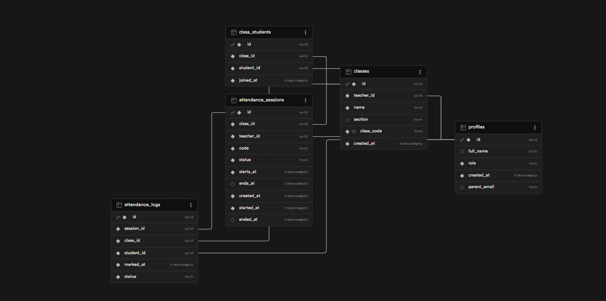

# Attendance Tracker App

A full-stack attendance management system built with React, Vite, and Supabase.

## Features

- Multi-role authentication (Admin, Teacher, Student)
- Two-factor authentication (2FA)
- Real-time attendance tracking
- Class management
- Attendance reports & exports (PDF, CSV)
- Email notifications

---

## Screenshots

### Main Login


### Admin Panel


### Teacher Dashboard


### Student Dashboard


### Database Structure


---

## Tech Stack

- **Frontend**: React, Vite
- **Backend**: Node.js, Express
- **Database**: Supabase
- **Authentication**: JWT, 2FA (Speakeasy)
- **Email**: Nodemailer
- **Exports**: jsPDF, csv-writer

---

## Getting Started

```bash
# Install dependencies
npm install

# Install backend dependencies
cd backend
npm install

# Run frontend
npm run dev

# Run backend
cd backend
node server.js
```

---

## Environment Variables

Create a `.env` file in the root and backend folder with your Supabase credentials.